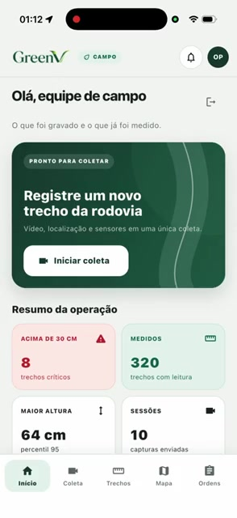
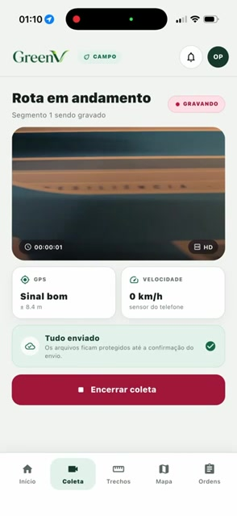
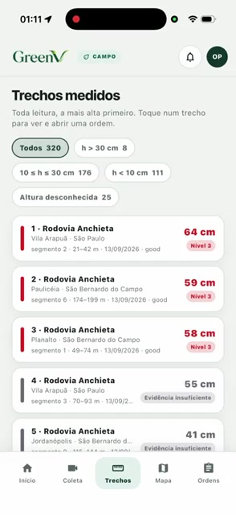
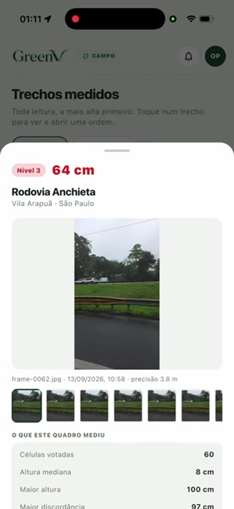
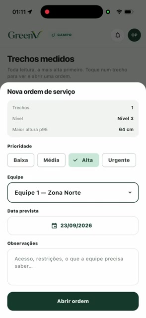
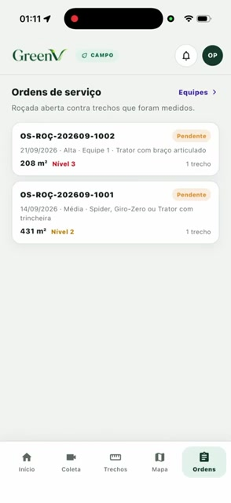
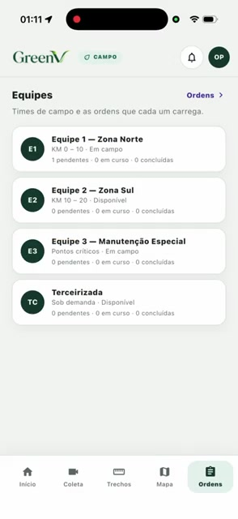
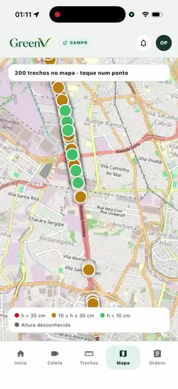

# GreenV — Sprint 3

Aplicativo móvel da Motiva para registrar rotas rodoviárias, enviar vídeo e telemetria para
processamento e acompanhar os trechos que exigem manutenção da vegetação.

## Integrantes

| Integrante | RM |
|---|---:|
| Helena Barbosa Costa | 562450 |
| Henrique Mandrick | 562715 |
| Mateus Scandiuzzi Valente Tomomitsu | 561565 |
| Ryan Amorim de Castro Santana | 564393 |
| Thomas Joh Kobayashi | 562758 |

## Vídeo de demonstração

A demonstração completa percorre os fluxos do produto em um iPhone real com iOS.

[](https://youtube.com/shorts/irqRgWPfklU?feature=share)

▶️ [Assistir no YouTube](https://youtube.com/shorts/irqRgWPfklU?feature=share)

## Migração para Flutter

O projeto das Sprints anteriores utilizava React Native com Expo. Na Sprint 3 o aplicativo foi
migrado integralmente para Flutter. A decisão começou pela familiaridade dos integrantes com Dart
e com a organização de projetos Flutter, o que permitiu dividir melhor as tarefas, revisar o código
em conjunto e resolver problemas com mais rapidez durante a sprint.

O Flutter também simplificou a manutenção de uma única base para Android, iOS e web. As mesmas
telas, regras de navegação e componentes são compartilhados entre as plataformas, reduzindo o
risco de um fluxo funcionar de maneira diferente em cada sistema. O código React Native foi
removido deste repositório, deixando uma estrutura única e direta para executar, testar e evoluir.

A possibilidade de executar a versão web localmente facilitou a revisão rápida das telas e dos
estados da interface. O Hot Reload permitiu ajustar layout, espaçamento e identidade visual sem
reiniciar todo o aplicativo. Para iOS, a mesma base pode ser aberta e testada no simulador ou em um
dispositivo a partir do macOS, sem manter uma implementação separada. No Android, o projeto pode
ser executado diretamente em emulador ou aparelho físico pelo Android Studio ou pela Flutter CLI.

Outro fator foi a estratégia de testes. O Flutter oferece testes de widgets que conseguem montar
as telas, preencher campos, tocar nos controles e conferir navegação e mensagens sem depender de
um dispositivo para cada execução. Esses testes complementam a validação em aparelho real e
ajudam a evitar regressões nos fluxos de login, coleta, mapa, trechos e ordens de serviço.

Para as funções de campo, o ecossistema Flutter forneceu integração adequada com câmera,
localização, sensores, armazenamento local e controle de tela ativa. Isso permitiu organizar a
captura e a fila de upload em camadas separadas da interface, mantendo os componentes visuais
reutilizáveis e o código de integração com a API isolado.

A mudança de stack preserva o escopo anterior: autenticação corporativa, dashboard, coleta de
vídeo, fila offline, acompanhamento do processamento, classificação da vegetação e mapa. A versão
Flutter também inclui consulta de frames, abertura de ordens de serviço e acompanhamento das
equipes.

## Integração

A execução usada na entrega não utiliza dados mockados. O aplicativo consome a API implantada em:

```text
https://greenvapi.matomomitsu.com
```

O endereço `https://greenv.matomomitsu.com` corresponde ao painel web. O subdomínio
`greenvapi.matomomitsu.com` é a API consumida pelo aplicativo móvel. O endpoint público de saúde
foi validado e responde com status `UP`.

Autenticação, sessões de captura, upload de segmentos, indicadores, trechos, frames, mapa, ordens
e equipes usam os contratos reais da API. Os objetos falsos presentes em `test/` são apenas dublês
de teste e não entram no aplicativo compilado.

Não existe criação de conta no app, pois o acesso é corporativo e os usuários são cadastrados de
forma centralizada. A recuperação de senha não faz parte desta entrega porque a API atual não
expõe esse contrato; por isso, a antiga tela apenas demonstrativa foi removida.

## Fluxo do aplicativo

O acesso é restrito a funcionários previamente cadastrados. Depois da autenticação, o fluxo segue
pelas etapas abaixo.

| 1. Visão geral da operação | 2. Coleta da rota |
|:---:|:---:|
|  |  |
| A página inicial apresenta os trechos críticos, total medido, maior altura e quantidade de sessões, além do atalho para iniciar uma coleta. | Durante a gravação, o aplicativo mostra a câmera, qualidade do GPS, velocidade e situação da fila. Vídeo e telemetria continuam protegidos mesmo sem conexão. |

| 3. Trechos processados | 4. Evidências da medição |
|:---:|:---:|
|  |  |
| Depois do processamento, os trechos aparecem ordenados pela maior vegetação. Os filtros separam níveis críticos, médios, baixos e leituras inconclusivas. | O detalhe reúne altura, nível, frames capturados e as medidas que justificam a classificação do trecho. |

| 5. Abertura de ordem de serviço | 6. Acompanhamento de ordens |
|:---:|:---:|
|  |  |
| Um trecho pode gerar uma ordem com prioridade, equipe responsável, data prevista e observações para o trabalho de campo. | A lista informa referência, data, prioridade, equipe, área, nível e situação de cada ordem aberta. |

| 7. Equipes de manutenção | 8. Mapa operacional |
|:---:|:---:|
|  |  |
| A visão de equipes mostra região atendida, disponibilidade e quantidade de ordens pendentes, em andamento e concluídas. | O mapa posiciona os trechos e diferencia por cor a vegetação crítica, intermediária, controlada ou sem altura conhecida. Um toque abre o detalhe e a criação de ordem. |

## Como executar

Pré-requisitos:

- Flutter 3.47.1 ou versão estável compatível;
- Dart 3.13.1 ou superior;
- Android Studio e Android SDK para Android;
- credencial corporativa previamente cadastrada na API.

Confira o ambiente e instale as dependências:

```bash
flutter doctor -v
flutter pub get
```

Execute apontando para a API implantada:

```bash
flutter run --dart-define=GREENV_API_URL=https://greenvapi.matomomitsu.com
```

Para escolher um dispositivo específico:

```bash
flutter devices
flutter run -d <id-do-dispositivo> \
  --dart-define=GREENV_API_URL=https://greenvapi.matomomitsu.com
```

## Funcionalidades e status

| Funcionalidade | Status | Integração |
|---|---|---|
| Login e renovação da sessão | Concluído | `/v2/oauth/token` |
| Logout e remoção da sessão local | Concluído | Sessão local do dispositivo |
| Dashboard com resumo da operação | Concluído | API de leituras e sessões |
| Coleta de vídeo em segmentos | Concluído | Câmera nativa e API de captura |
| GPS, velocidade e sensores | Concluído | Sensores do dispositivo |
| Fila offline e reenvio | Concluído | Armazenamento local persistente |
| Lista e filtros de trechos | Concluído | API de leituras |
| Detalhes, frames e medições | Concluído | API de frames e resultados |
| Mapa georreferenciado | Concluído | API de trechos e OpenStreetMap |
| Criação de ordem de serviço | Concluído | API de ordens |
| Lista de ordens e equipes | Concluído | API de operações |
| Estados vazios, carregamento e erro | Concluído | Respostas reais e tratamento no cliente |

## Fluxos navegáveis

1. Entrar com uma conta corporativa e sair com segurança.
2. Consultar métricas e sessões recentes no dashboard.
3. Iniciar e encerrar uma coleta, acompanhando GPS, velocidade e fila de envio.
4. Consultar e filtrar trechos por nível de vegetação.
5. Abrir um trecho para visualizar frames e detalhes da medição.
6. Visualizar a rota e os trechos georreferenciados no mapa.
7. Criar uma ordem de serviço a partir de um trecho medido.
8. Consultar ordens e disponibilidade das equipes.
9. Continuar uma coleta sem rede e reenviar a fila quando a conexão voltar.

## Testes realizados

Os testes manuais foram executados no aplicativo Flutter em um iPhone com iOS, conectado à API
publicada em `https://greenvapi.matomomitsu.com`. Foram utilizadas credenciais corporativas e dados
reais do ambiente integrado. A demonstração em vídeo disponível no início deste README registra os
principais fluxos abaixo.

O relatório completo também está disponível em
[TESTES_MANUAIS.md](TESTES_MANUAIS.md).

| Cenário testado | Resultado esperado | Resultado obtido | Status |
|---|---|---|:---:|
| Autenticar com uma conta corporativa válida | A API deve validar as credenciais, criar a sessão e abrir a página inicial. | A autenticação foi concluída e o dashboard foi exibido com a sessão ativa. | Passou |
| Consultar o dashboard operacional | A tela deve apresentar os indicadores, sessões recentes e o atalho para iniciar uma coleta. | Os dados retornados pela API foram carregados e os componentes da página responderam corretamente. | Passou |
| Iniciar e encerrar uma coleta de rota | O aplicativo deve abrir a câmera, acompanhar GPS, velocidade e sensores, segmentar a gravação e finalizar a sessão sem travar. | A coleta foi iniciada, a telemetria foi atualizada durante o percurso e a sessão foi encerrada corretamente. | Passou |
| Consultar e filtrar os trechos processados | A lista deve carregar os trechos da API e permitir a filtragem pelo nível da vegetação. | Os trechos foram apresentados e os filtros atualizaram a listagem conforme a classificação escolhida. | Passou |
| Abrir os detalhes e as evidências de um trecho | A tela deve mostrar altura, nível, medições e frames relacionados ao trecho selecionado. | O detalhe correto foi aberto e as informações e imagens vinculadas foram exibidas. | Passou |
| Visualizar os trechos no mapa | O mapa deve posicionar os trechos georreferenciados, aplicar as cores de classificação e permitir abrir um item. | Os marcadores foram carregados nas posições esperadas e o toque abriu o fluxo do trecho selecionado. | Passou |
| Criar uma ordem de serviço | O formulário deve aceitar prioridade, equipe, data e observações e enviar a ordem para a API. | A ordem foi enviada com sucesso e passou a aparecer na relação de ordens cadastradas. | Passou |
| Consultar ordens e equipes | As telas devem listar situação, prioridade e equipe das ordens, além da disponibilidade das equipes. | As duas listagens foram carregadas com os dados da API e permaneceram navegáveis. | Passou |
| Encerrar a sessão do usuário | O aplicativo deve apagar a sessão local e retornar para a tela de login. | O logout removeu a sessão armazenada e exibiu novamente a autenticação corporativa. | Passou |

Além da validação manual, o projeto possui testes automatizados para autenticação, contratos HTTP,
captura, telemetria, armazenamento persistente, fila de upload, modelos de domínio, telas e
navegação. A suíte contém 71 testes e foi executada integralmente com sucesso por meio de
`flutter test`. O código também passou pelo `flutter analyze` sem apontamentos, e o APK Android de
depuração foi gerado com sucesso usando a URL da API publicada.

## Organização do código

| Caminho | Responsabilidade |
|---|---|
| `lib/src/ui/` | Telas, navegação e componentes visuais reutilizáveis |
| `lib/src/domain/` | Modelos de captura e operação |
| `lib/src/capture/` | Câmera, telemetria e coordenação dos segmentos |
| `lib/src/storage/` | Fila local persistente e sessão do usuário |
| `lib/src/upload/` | Envio serializado e retentativas |
| `lib/src/api/` | Autenticação e gateways HTTP |
| `lib/src/bootstrap/` | Montagem das dependências para cada plataforma |
| `test/` | Testes de API, domínio, armazenamento, captura e interface |

## Verificação

```bash
dart format --output=none --set-exit-if-changed lib test
flutter analyze
flutter test
flutter build apk --debug \
  --dart-define=GREENV_API_URL=https://greenvapi.matomomitsu.com
```

O vídeo publicado está disponível no início deste documento e o arquivo final de entrega contém o
mesmo link.
